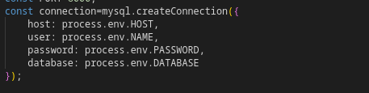

# restuarant management system

after cloning, run:
*npm install*
to install all packages

get inside server.js and connect to your mysql 

check the tables for database from /server/models

to run the code:
1. get inside my-app and server folder in different terminals
2. and run
   
    *npm start*

